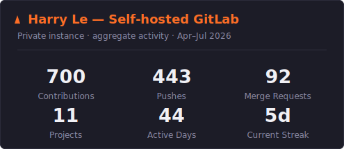

<h1 align="center">Hi, I'm Harry Le 👋</h1>

  <b>Software Lead, R&D @ Vinatech Solutions</b> · Full-Stack Engineer building the software behind automated warehouses

  
  
  

---

### 🚀 About Me

I build software that turns messy, real-world operations into systems that scale — from the microservices that talk to physical robots and shuttles, up to the dashboards operators use to run the warehouse floor.

- 🏭 Leading the R&D software team behind **AUTOVTS** — a warehouse-automation platform spanning **WMS**, **WCS**, and **ASRS**.
- ⚙️ I love **event-driven Go microservices**, **real-time device integration** (MQTT / WebSockets), and clean **React/TypeScript** front ends.
- 🤖 Early career in **computer vision & deep learning** (YOLOv5, Facenet, TensorFlow) that still shapes how I approach data-heavy problems.
- 🌱 5+ years across AI, cloud, product, and engineering leadership — ex-Bosch, ex-CTO @ Orthian.
- 💬 Ask me about scalable architecture, software for the physical world, or building engineering teams.

---

### 🛠️ Tech Stack

**Languages**

**Frontend**

**Backend & Real-time**

**Data & Infrastructure**

**Cloud**

**AI/ML**

---

### 📊 GitHub Metrics

<!--
  Rendered by lowlighter/metrics via .github/workflows/metrics.yml and committed
  as github-metrics.svg (served by GitHub, so it never rate-limits). The image
  below appears after the workflow's first run.
-->

<!--
  SELF-HOSTED GITLAB ACTIVITY:
  A scheduled job (gitlab_metrics.py) renders your git.vinatech.app activity to
  `gitlab-metrics.svg` and commits it here. Once that SVG exists, uncomment the line below.
-->
<!-- 

 -->

  

---

<i>“Where a bug isn't a broken page — it's a stopped machine.”</i>

